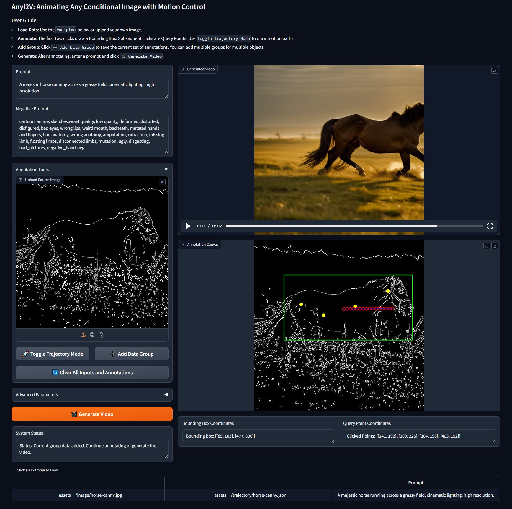

<p align="center">
  <h2 align="center">AnyI2V: Animating Any Conditional Image with Motion Control Generation</h2>
  <p align="center">
    <a href=https://github.com/ZyLieee/><strong>Ziye Li</strong></a><sup>1</sup>
    ·
    <a href=https://scholar.google.com/citations?user=7QvWnzMAAAAJ&hl/><strong>Hao Luo</strong></a><sup>2,3</sup>
    ·
    <a href=https://scholar.google.com/citations?user=kLY6SUMAAAAJ&hl/><strong>Xincheng Shuai</strong></a><sup>1</sup>
    ·
    <a href=https://henghuiding.com/><strong>Henghui Ding ✉️ </strong></a><sup>1</sup>
</p>

<p align="center"><strong></strong></a>
<p align="center">
    <sup>1</sup>Fudan University · <sup>2</sup>DAMO Academy, Alibaba group  · <sup>3</sup>Hupan Lab
</p>
   <h3 align="center">
<p align="center">
  <video width="75%" controls>
    <source src="__assets__/video/video.mp4" type="video/mp4">
    Your browser does not support the video tag.
  </video>
</p>


https://github.com/user-attachments/assets/2c1616ff-5fe0-4bce-9f63-04d768191c4c


## Quick Start
## ⚙️1. Setup repository and environment

```
git clone https://github.com/ZyLieee/AnyI2V.git
cd AnyI2V

conda create -n anyi2v python=3.10
pip install -r requirements.txt
```

###  2. Run the script

#### 📌 2.1 Local script

The video will be save into ./samples

```
python -m scripts.AnyI2V_fp16 --config configs/prompts/1_1_animate_RealisticVision.yaml
```

####  🤗 2.2 Gradio app

The demo will run at `localhost:7860` with the default setting.

```
python -m scripts.app
```


## BibTeX
Please consider to cite AnyI2V if it helps your research.

```bibtex
@inproceedings{AnyI2V,
  title={{AnyI2V}: Animating Any Conditional Image with Motion Control Generation},
  author={Li, Ziye and Luo, Hao and Shuai, Xincheng and Ding, Henghui},
  booktitle={ICCV},
  year={2025}
}